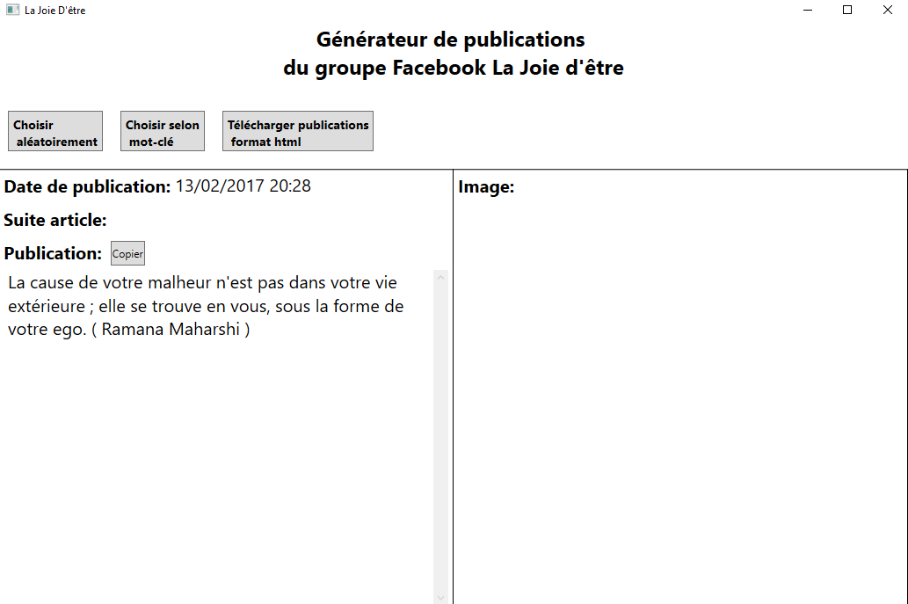

Il s'agit d'une interface WPF pour choisir de manière aléatoire ou par mot-clé une citation spirituel selon la liste de toutes les citations partagées sur le groupe Facebook La Joie d'Être (https://www.facebook.com/groups/593344600799702/?ref=direct).

**Les sous projets**
--------------------

**GetRandomPublicationInterface**: L'application en WPF.

**GroupPublicationParser**: Transforme les publications du groupe en format HTML en un fichier JSON plus facilement consommable pour l'interface. Devrait idéalement utiliser l'API Facebook pour faciliter les mises à jour.

**Installer**: Créer une application d'installation Windows pour facilement installer l'interface. Fonctionne pour les ordinateurs avec Windows 7 et plus.

**Utilisation**
-----------------

-Pour simplement installer l'application, télécharger ici: https://www.dropbox.com/s/8agt0bh1ntak1f2/InstallationAppJoieEtre.msi?dl=0

-Sinon cloner le projet.

**À faire**
--------------------

-Modifier le sous projet GroupPublicationParser pour utiliser l'API Facebook pour plus facilement mettre à jour l'application.

-Permettre de montrer et naviguer à travers tous les résultats de la recherche par mot-clé.

-Porter le projet sur Linux et Android en utilisant React Native ou QT pour l'interface ?